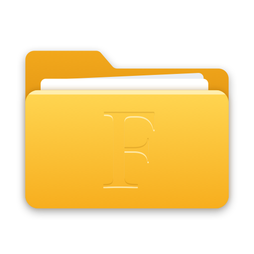
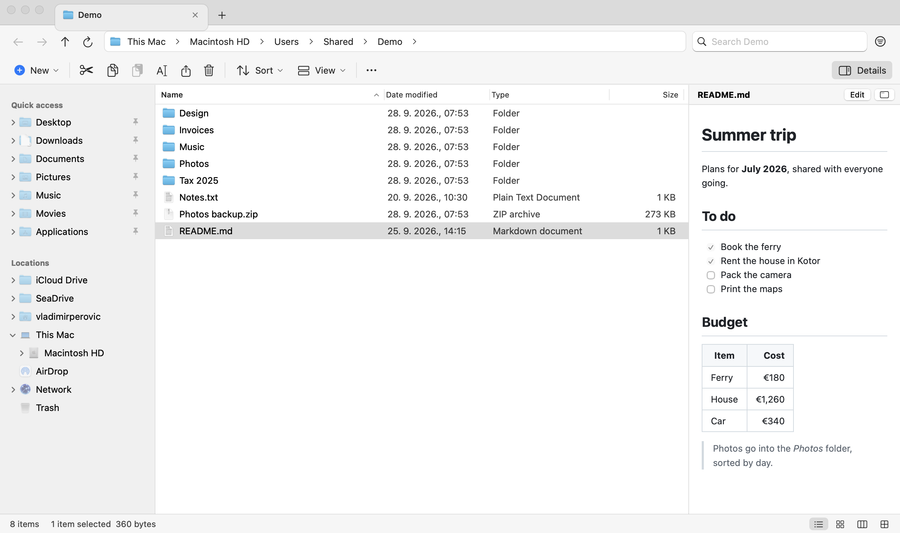
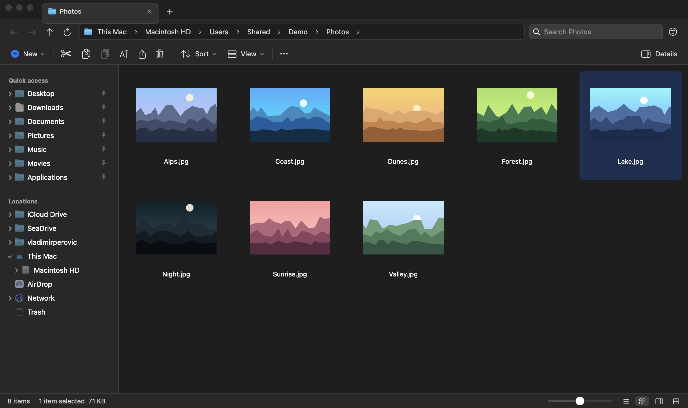
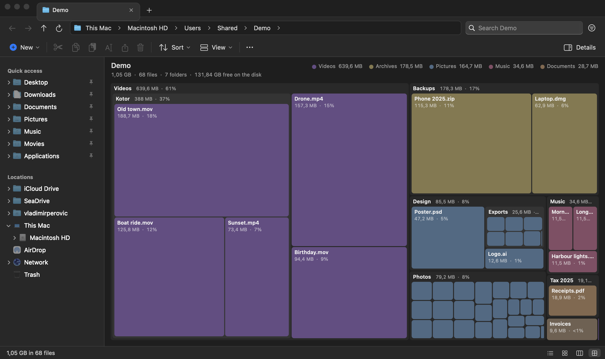

<p align="center"></p>

<h1 align="center">Foldera</h1>

<p align="center">
A small file manager for the Mac that works like Windows Explorer.<br>
Native Swift and AppKit, no dependencies, about 1.5 MB.
</p>

> [!WARNING]
> **Beta (0.2).** Foldera is in daily use, but it is young. It moves, copies
> and deletes real files, so keep backups (Time Machine) and report anything
> odd in [Issues](https://github.com/vladimirperovic/Foldera/issues).



If you came to the Mac from Windows and miss Explorer, this is for you:
the address bar, the navigation pane, the Details list with Enter, F2 and
Backspace, tabs in the title bar, Cut and Paste, a Size column in KB. It
also has things Explorer never had: a picture viewer in the manner of
FastStone, zip/RAR/7z archives you walk into like folders, a disk usage
map, and Markdown files shown (and edited) in the details pane.

| | |
|---|---|
|  |  |

## Install

1. Download `Foldera-0.2.0-beta.zip` from
   [Releases](https://github.com/vladimirperovic/Foldera/releases), unzip it,
   and drag **Foldera** to Applications.
2. Open it. The beta is not notarized by Apple yet, so macOS refuses the
   first time: go to **System Settings › Privacy & Security**, scroll down,
   and click **Open Anyway** next to Foldera. Or, in Terminal:

   ```bash
   xattr -dr com.apple.quarantine /Applications/Foldera.app
   ```

Needs macOS 14 (Sonoma) or later on an Apple silicon Mac. To build it
yourself, see [Building](#building).

## Layout

- **Address bar**: `This Mac › Macintosh HD › Users › you`. Click a part to
  go there. Click a `›` for a menu of the folders inside. Click the empty
  area (or ⌘L, F4, ⌥D) to type a path, including `\\server\share`; Tab
  completes folder names. A long path folds its start into `«`.
- **Command bar**: New ▾, Cut, Copy, Paste, Rename, Share, Delete, Sort ▾,
  View ▾, ⋯, and **Details** at the far right for the details pane.
- **Navigation pane**, in two sections:
  - **Quick access**: pinned folders and files, marked with a pin.
    Right-click → *Add to Quick access*, or drop a folder into the section.
    Drag to reorder.
  - **Locations**, as in Finder:
    - iCloud Drive and the drives cloud apps add (SeaDrive, OneDrive, Google
      Drive, Dropbox…);
    - home and This Mac with its drives;
    - AirDrop and Network (the file servers nearby);
    - Trash (drop files on it; right-click → Empty Trash).
  - Every folder unfolds into a tree.
- **Layouts**: **Details** (⌘1), **Large icons** with thumbnails (⌘2) and
  **Columns** (⌘3, as in Finder).
  - Details shows Name, Date modified, Type and Size (in KB, as Windows
    does), with folders first. A **Status** column appears for iCloud Drive
    items.
  - Finder tags show as coloured dots after the name.
- **Details pane** (⇧⌘P or ⌥P, Alt+P in Windows) on the right:
  - a Quick Look preview of the selected file;
  - its type, size, dates, tags and iCloud state;
  - picture dimensions and camera, PDF page count, running time, and where
    a download came from;
  - for a folder, how many items it holds.
- **Status bar**: item count, selection and its size, and the layout switch.
- **Search** (top right): searches the folder and everything below it as
  you type. `*.pdf` works.
  - **Search options** (the button beside the box, ⌥⌘F): kind (pictures,
    videos, music, documents, archives, apps, folders), size, and date
    modified (today, this week…).
  - With an option set and the box empty, it lists everything that
    matches.
- **Tabs**, Windows 11 style, in the title bar:
  - each about 220 points (4–5 cm on a MacBook), with the + right after the
    last one;
  - ⌘T opens one, ⌘W closes one (⇧⌘W closes the window), ⌃Tab switches;
  - middle-click a folder to open it in a background tab, and middle-click
    a tab to close it;
  - drag tabs to reorder them; right-click a tab for Duplicate, Move to New
    Window, and Close Others.

When the window gets narrow, the file list gives way first, then the
details pane, then the navigation pane. Each keeps a usable width, and each
gets back the width you dragged it to once there is room again.

## Keys

| Windows habit | Here |
|---|---|
| Enter opens · Backspace goes back | same |
| Alt+← → ↑ | ⌥← ⌥→ ⌥↑ |
| F2 rename · F5 refresh · F3 search · F4 / Alt+D address | same |
| Delete → Recycle Bin · Shift+Delete → gone | fn+Delete → Trash · ⇧fn+Delete → gone (asks first) |
| Ctrl+Z / Ctrl+Y undo, redo | ⌘Z / ⇧⌘Z |
| Ctrl+X / C / V · Ctrl+Shift+C copy as path | ⌘X / C / V · ⇧⌘C |
| Ctrl+Shift+N new folder · Alt+Enter properties | ⇧⌘N · ⌥↩ (or ⌘I) |
| Alt+P preview pane | ⌥P or ⇧⌘P |
| — | Space: Quick Look · ⇧⌘. hidden files · ⌘K connect to server |

## Disk usage and folder sizes

- **Disk usage** (⌘4, View ▾, or right-click a folder → *Analyze disk usage*)
  draws the folder as a treemap, after tobi's
  [disktree](https://github.com/tobi/disktree):
  - every folder is a box sized by what it takes on disk, with the folders
    inside it drawn inside;
  - files are coloured by kind; small files are summed per folder;
  - click to select (the details pane and the status bar show its size and
    share), double-click to go in, right-click for the usual menu.
  - Moving something to the Trash takes it out of the picture right away.
  - F5 measures again.
- **Folder sizes** (View ▾): the Size column shows what each folder holds,
  measured in the background. Windows doesn't do this.
- Measuring runs in the background and is remembered for the session, so
  walking into a folder already measured is instant.
- **Picture size**: in Large icons, a slider in the status bar (48–256
  points), or ⌘+ / ⌘−, or ⌘ (or ⌃) with the scroll wheel.

## Copying, moving, undo

- **Paste into the same folder** makes `name - Copy`.
- **Name clashes** ask Replace / Keep both / Skip / Stop. A replaced item
  goes to the Trash.
- **Folders with the same name are merged**, as in Windows. Clashing files
  inside are asked about one by one, or all at once.
- **Large copies** show a progress window with Cancel. A cancelled copy
  leaves no half-copied file behind, and a move deletes the original only
  once every byte has arrived. On APFS a copy is a clone and takes no
  space.
- **Dragging**: onto the same drive moves; onto another drive copies; ⌥
  always copies. Cut items show faded.
- **⌘Z undoes** copies, moves, renames, new items, zips and trips to the
  Trash, newest first. ⇧⌘Z redoes them. The history is shared by all
  windows and the viewer.

## Archives: zip, RAR, 7z, tar

- **Open an archive like a folder** (Enter or double-click), as Windows does
  with a zip. It works for zip, RAR (4 and 5), 7z, tar, tar.gz, tar.bz2,
  tar.xz, cab and lzh.
  - Inside, you can browse, preview, Quick Look, open files, and copy or
    drag them out.
  - It is read-only: nothing can be added, renamed or deleted inside.
  - **Extract all** sits at the right of the command bar.
- **Extract All / Extract To…** from the right-click menu, for all of those
  formats.
  - Progress and Cancel, like copying.
  - An archive holding one folder does not unpack into `name/name`.
  - Entries whose names would land outside the target folder (`../`,
    absolute paths) are left out.
- **Compress to ▸ ZIP / 7z / TAR.GZ**. Zips are plain, without `__MACOSX`,
  so they open cleanly on Windows.
- **Passwords**: a password-protected zip asks for its password. macOS's
  archive library can't decrypt encrypted RAR or 7z archives, and says so.
  Multi-part RARs (`.part1.rar`) and `.tar.zst` are not supported.

The archive support is the libarchive that macOS ships (the one behind
`/usr/bin/tar`), called directly. An opened archive is unpacked once into
`~/Library/Caches/Foldera/Archives`, which is emptied when Foldera
starts and quits.

## More

- **AirDrop** and **Share**, from the right-click menu.
- **Tags**: the right-click menu lists Finder's tags. Choosing one adds it,
  or removes it if every selected item already has it.
- **iCloud Drive**:
  - the Status column shows each item's state: cloud-only, downloaded,
    downloading or uploading;
  - *Download Now* keeps a copy on this Mac;
  - *Remove Download* frees the space and leaves the file in iCloud (Windows'
    "Free up space").
- **Connect to Server** (⌘K): `smb://nas.local/Photos`, a bare IP address or
  `\\server\share`. macOS asks for the password, and the share opens here.

## Markdown

Select a `.md` file and the details pane shows it rendered, GitHub-style:
tables, task lists, code and pictures. **Edit** switches to the text right
there; **Done** or ⌘S saves. The window button (or right-click → *Edit
Markdown*) opens an editor with the text and the rendered page side by
side, updated as you type.

HTML in a Markdown file is shown as text, never run, and scripts are off
in the view. The view can't read files on its own: Foldera hands it only the
pictures in the file's folder and up to two folders above it
(`../images/x.png` works; a picture elsewhere on the disk stays blank).

## Picture viewer

Enter or a double-click on a picture opens the viewer, with the folder's
other pictures one key away. It handles JPEG, PNG, WebP, HEIC, AVIF, JPEG XL,
GIF, TIFF, BMP, ICO, TGA, PSD, SVG and camera RAW (CR2, CR3, NEF, ARW,
DNG…). macOS decodes all of them itself.

| | |
|---|---|
| → ← · Space · wheel | next / previous |
| click | fit ↔ actual size at that spot; drag to pan |
| + − · 0 · 1 · pinch · ⌘/⌥ + wheel | zoom · fit · 100% |
| F or Enter · double-click | full screen |
| R · L | rotate (view only) |
| I | EXIF panel (camera, lens, exposure, GPS…) |
| S | slideshow |
| Delete | to the Trash (⌘Z brings it back), then the next picture |
| E | open in the default app (Preview, Photoshop…) |
| Esc | leave full screen / close |

The viewer decodes pictures at screen resolution and keeps the one before
and after ready. It loads the full resolution only when you zoom past the
screen's resolution.

Turn the viewer off under View › Open Pictures in Foldera's Viewer.
Foldera also appears under **Open With** for pictures in Finder.

## Open folders in Foldera instead of Finder

Foldera › *Open Folders in Foldera…* makes it the default for folders
opened from other apps, the Dock and `open .`. It also becomes the target
of "Show in Finder" in most apps. *Open Folders in Finder Again* undoes
this. Finder keeps running for the desktop.

## Building

Needs macOS 14 or later and the Swift 6 toolchain (the Command Line Tools
are enough).

```bash
./build.sh            # build/Foldera.app, ad-hoc signed for this Mac
./build.sh install    # …and copy it to /Applications
./test.sh             # the tests (swift test, with a workaround for the CLT)
```

Protected folders (Desktop, Documents, Downloads) ask for permission the
first time. Every new build gets a new ad-hoc signature, so macOS asks
again after each rebuild. Full Disk Access for Foldera stops the prompts.

`Foldera --snapshot <folder|image> out.png [--icons|--columns] [--pane]
[--light|--dark] [--size WxH] [--search text] [--select name] [--press keys]`
renders a window to a PNG. It is used during development to check the
interface without clicking (the screenshots above were made this way, of a
made-up folder). It leaves your settings as they were.

## License and credits

[MIT](LICENSE). The F on the icon is Cormorant Garamond by Christian
Thalmann (SIL Open Font License). Inspired by
[Search](https://github.com/driceroland/Search) by driceroland; the disk
usage map follows tobi's [disktree](https://github.com/tobi/disktree).
